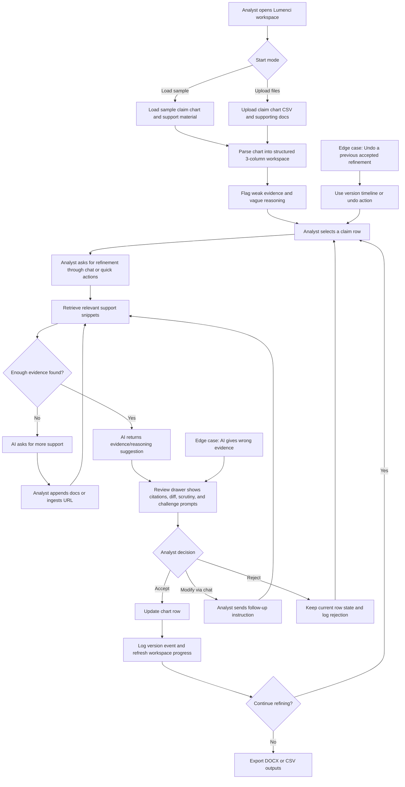

# Lumenci Assignment: Prototype Evolution and Product Thinking Story

## Recruiter Summary
For the Lumenci Associate Product Manager assignment, I treated the prototype as more than a coding exercise. I used AI vibe-coding tools to move quickly, but I did not accept the first output as the final answer. I started with a Streamlit version to validate the core claim-chart-refinement loop, decided it was too generic for a conversation-heavy legal workflow, and rebuilt the experience as a custom FastAPI + HTML/CSS/JavaScript workspace. From there, I iterated repeatedly on product structure, human-in-the-loop safeguards, evidence review, versioning, layout, and responsiveness until the prototype felt closer to an analyst tool than a demo dashboard.

The result is a stronger Section 2 submission than my original first pass. It now shows end-to-end claim chart upload, row-level conversational refinement, source-backed AI suggestions, diff-first review, accept/reject/modify loops, undo/version history, export flows, and edge-case handling when evidence is weak or missing. Just as importantly, it shows how I think: I used the vibe-coding tool as a fast execution partner, but the product direction, critique, and iteration decisions were mine.

## What I Built in the Final Prototype
- Upload or load a sample claim chart workspace with supporting documents.
- Parse the claim chart into a structured three-column analyst workspace.
- Flag rows with weak evidence or vague reasoning.
- Let the analyst select a row and request refinement through chat or quick actions.
- Retrieve relevant support snippets before generating a suggestion.
- Show AI output in a review drawer with evidence changes, reasoning changes, citations, scrutiny signals, and challenge-readiness prompts.
- Require a human decision before updating the chart.
- Support accept, reject, modify-via-chat, undo last accepted change, and version logging.
- Allow analysts to append new supporting documents or ingest a URL when the model needs stronger evidence.
- Export the refined chart and supporting summary files for downstream legal use.

## Why the Product Improved Through Iteration
I did not stay attached to the first implementation. I used a rapid-iteration loop:

1. Build the fastest version that proves the core job-to-be-done.
2. Critique the user experience as if I were the analyst.
3. Identify where the workflow feels generic, confusing, risky, or visually weak.
4. Redirect the vibe-coding tool with precise product and UX changes.
5. Verify the updated interaction and continue refining.

That loop led to meaningful product improvements, not just cosmetic polish.

## Versioned Product Journey
| Version | What I changed | Why I changed it | Product outcome |
| --- | --- | --- | --- |
| `v0` | Built the first working prototype in Streamlit | I wanted to validate the basic claim chart upload, chat refinement, accept/reject, and export loop as quickly as possible | Fast proof of concept, but the experience felt too dashboard-like and not tailored enough for a conversational legal workflow |
| `v1` | Moved to a custom FastAPI + HTML/CSS/JavaScript SPA | Streamlit limited layout control and made it harder to shape a purpose-built analyst workspace | Gained full control over workflow structure, chat behavior, review surfaces, and exports |
| `v1.1` | Added a guided workflow rail and a structured claim-chart workspace | I wanted the product to teach the workflow, not just expose controls | Better onboarding, clearer next steps, stronger assignment narrative |
| `v1.2` | Introduced a dedicated review drawer with accept/reject/modify decisions | AI output should never overwrite the chart silently in a legal context | Stronger human-in-the-loop pattern and lower trust risk |
| `v1.3` | Added version history, undo, and export-ready reference surfaces | Analysts need recoverability and auditability, especially if AI gets something wrong | Made the prototype feel safer and more credible for legal review work |
| `v1.4` | Added supporting-doc append and URL ingestion mid-review | The model should have a productive failure path when evidence is weak or missing | Better handling of the "AI cannot find evidence" edge case from the assignment |
| `v1.5` | Reworked the right-side review experience, metrics, diff view, and responsive behavior | The prototype needed to look and behave like a product, not a rough AI output dump | Cleaner review workflow, clearer change presentation, stronger recruiter-facing polish |

## What I Achieved in Section 2 of the Assignment
The assignment asked for a functional working prototype. My final prototype covers the requested flow and goes beyond it in several ways.

### Assignment Requirements Met
- User starts by uploading documents or loading a sample workspace.
- The product displays the three-column claim chart in the interface.
- The user sends a refinement request through chat.
- AI responds with a specific improvement recommendation.
- The analyst can accept, reject, or continue modifying via conversation.
- The updated claim chart reflects approved changes.

### Additional Product Value I Added
- Diff-first review instead of blind overwrite.
- Citation-aware suggestions with source snippets.
- Scrutiny and challenge-readiness views to simulate legal defensibility review.
- Mid-workflow evidence expansion via new uploads or URL ingestion.
- Version timeline plus undo for recoverability.
- KPI-style progress view from initial chart state to current state.
- Guided onboarding rail that can be hidden once the user no longer needs it.

## Product Decisions That Show My Thinking
### 1. I chose not to rely on raw prompt engineering as the user experience
The brief mentions system prompts or instructions, but in practice I chose to encode guidance into the product itself through workflow rails, quick actions, review states, and structured UI. My reasoning was that patent analysts should not need to think like prompt engineers to get value from the product.

### 2. I treated AI as a collaborator that must be reviewed, not an auto-apply engine
In patent infringement analysis, wrong evidence and weak reasoning are costly. That is why the final product uses a review drawer, source inspection, accept/reject/modify decisions, and version logging before any claim-chart update is applied.

### 3. I designed for failure and recovery, not just for the happy path
I added explicit flows for wrong evidence, missing evidence, undo, and iterative follow-up because conversational AI systems become useful only when users can recover quickly from imperfect output.

## Edge Cases I Solved While Building the Prototype
These are the product and design issues I actively identified, tested, and fixed during the vibe-coding process.

- `AI gives wrong evidence`
  I added source-backed review, citations, and accept/reject/modify loops so analysts can inspect and correct output instead of trusting it blindly.
- `User wants to undo a previous refinement`
  I added version history plus "undo last accepted change" so the workflow remains reversible.
- `AI cannot find strong evidence`
  I added append-supporting-docs and ingest-URL flows so the system can ask for more evidence and continue.
- `Streamlit felt too generic for the task`
  I rebuilt the experience as a custom web application with a more intentional analyst workflow.
- `Guided flow took too much space after onboarding`
  I kept it vertical on the left and added hide/unhide behavior.
- `The score visualization looked outdated`
  I replaced older gauge-like visuals with more modern live metric rings.
- `Chat and review were competing in one panel`
  I separated the refinement assistant from the review drawer so reviewing changes does not get buried inside long chat history.
- `Sticky side panels were colliding with lower sections`
  I removed layout behaviors that caused the review drawer and guided flow to end awkwardly near the Reference Center.
- `The diff looked like raw developer patch output`
  I translated the review experience into recruiter-friendly and analyst-friendly "Removed Wording / Added Wording" cards instead of showing raw `--- / +++ / @@` diff metadata.
- `The review drawer was not adapting well to narrow width`
  I made tabs, metrics, scores, diff summaries, and comparison blocks responsive to the drawer itself instead of assuming full-page width.

## How This Demonstrates Vibe-Coding Skill
My goal was not to simply say "I used AI to build it." My goal was to show that I can direct AI tooling like a product builder:

- I used AI to accelerate implementation speed.
- I evaluated whether the generated output actually served the user workflow.
- I changed architecture when the first stack choice no longer supported the product intent.
- I converted vague dissatisfaction ("this feels wrong") into concrete product requirements and UI changes.
- I kept iterating until the prototype better matched the legal-analysis context and the assignment’s human-in-the-loop expectations.

In other words, the value was not just that I built quickly. The value was that I used AI tools while still exercising judgment, prioritization, critique, and product ownership.

## Current User Flow (Mermaid)

## Short Recruiter-Facing Closing Paragraph
This assignment started as a simple prototype exercise, but I approached it as a product iteration problem. I used AI vibe-coding tools to accelerate build speed, then repeatedly improved the experience based on workflow fit, user trust, edge cases, and presentation quality. The final prototype is stronger than my original first pass because it reflects not just execution speed, but product judgment.
