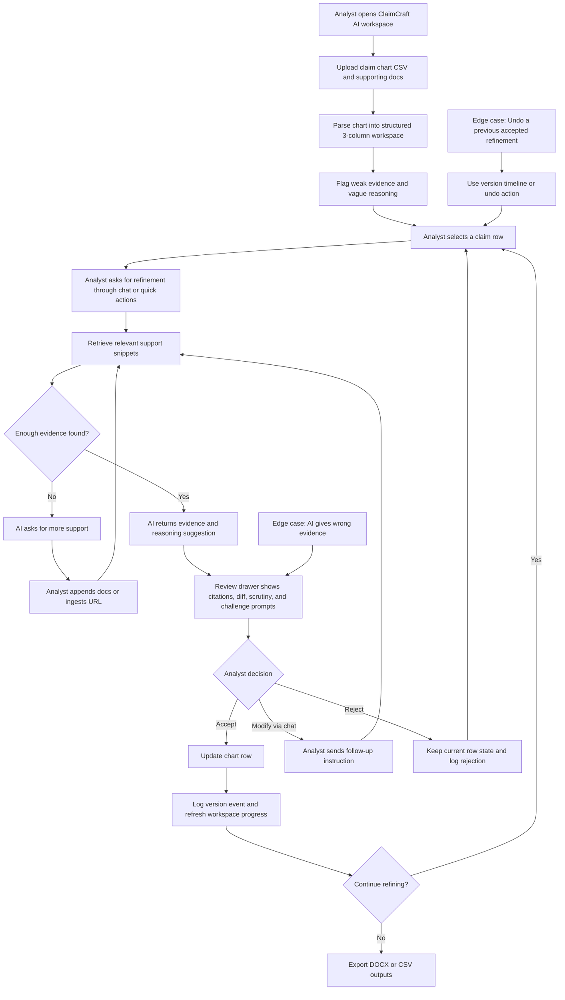

# ClaimCraft AI: Portfolio Case Study

## Summary
I built ClaimCraft AI as a portfolio project to explore how AI could support patent-claim-chart refinement without turning a high-stakes workflow into a black-box generation experience. I used AI vibe-coding tools to move quickly, but I did not accept the first output as the final answer. I started with a Streamlit version to validate the core claim-chart-refinement loop, decided it was too generic for a conversation-heavy legal workflow, and rebuilt the experience as a custom FastAPI + HTML/CSS/JavaScript workspace. From there, I iterated repeatedly on product structure, human-in-the-loop safeguards, evidence review, versioning, layout, and responsiveness until the prototype felt closer to an analyst tool than a demo dashboard.

The final result shows end-to-end claim chart upload, row-level conversational refinement, source-backed AI suggestions, diff-first review, accept/reject/modify loops, undo/version history, export flows, and edge-case handling when evidence is weak or missing. Just as importantly, it shows how I think: I used the vibe-coding tool as a fast execution partner, but the product direction, critique, and iteration decisions were mine.

## What I Built
- Upload a claim chart workspace with supporting documents.
- Parse the claim chart into a structured three-column analyst workspace.
- Flag rows with weak evidence or vague reasoning.
- Let the analyst select a row and request refinement through chat or quick actions.
- Retrieve relevant support snippets before generating a suggestion.
- Show AI output in a review drawer with evidence changes, reasoning changes, citations, scrutiny signals, and challenge-readiness prompts.
- Require a human decision before updating the chart.
- Support accept, reject, modify-via-chat, undo last accepted change, and version logging.
- Allow analysts to append new supporting documents or ingest a URL when the model needs stronger evidence.
- Export the refined chart and supporting summary files for downstream legal use.

## Why the Product Improved Through Iteration
I did not stay attached to the first implementation. I used a rapid iteration loop:

1. Build the fastest version that proves the core job-to-be-done.
2. Critique the user experience as if I were the analyst.
3. Identify where the workflow feels generic, confusing, risky, or visually weak.
4. Redirect the vibe-coding tool with precise product and UX changes.
5. Verify the updated interaction and continue refining.

That loop led to meaningful product improvements, not just cosmetic polish.

## Versioned Product Journey
| Version | What I changed | Why I changed it | Product outcome |
| --- | --- | --- | --- |
| `v0` | Built the first working prototype in Streamlit | I wanted to validate the basic claim chart upload, chat refinement, accept/reject, and export loop as quickly as possible | Fast proof of concept, but the experience felt too dashboard-like and not tailored enough for a conversational legal workflow |
| `v1` | Moved to a custom FastAPI + HTML/CSS/JavaScript SPA | Streamlit limited layout control and made it harder to shape a purpose-built analyst workspace | Gained full control over workflow structure, chat behavior, review surfaces, and exports |
| `v1.1` | Added a guided workflow rail and a structured claim-chart workspace | I wanted the product to teach the workflow, not just expose controls | Better onboarding and clearer next steps |
| `v1.2` | Introduced a dedicated review drawer with accept/reject/modify decisions | AI output should never overwrite the chart silently in a legal context | Stronger human-in-the-loop pattern and lower trust risk |
| `v1.3` | Added version history, undo, and export-ready reference surfaces | Analysts need recoverability and auditability, especially if AI gets something wrong | Made the prototype feel safer and more credible for legal review work |
| `v1.4` | Added supporting-doc append and URL ingestion mid-review | The model should have a productive failure path when evidence is weak or missing | Better handling of the missing-evidence edge case |
| `v1.5` | Reworked the right-side review experience, metrics, diff view, and responsive behavior | The prototype needed to look and behave like a product, not a rough AI output dump | Cleaner review workflow, clearer change presentation, stronger portfolio polish |

## Product Decisions That Show My Thinking
### 1. I chose not to rely on raw prompt engineering as the user experience
I encoded guidance into the product itself through workflow rails, quick actions, review states, and structured UI. My reasoning was that analysts should not need to think like prompt engineers to get value from the product.

### 2. I treated AI as a collaborator that must be reviewed, not an auto-apply engine
In patent infringement analysis, wrong evidence and weak reasoning are costly. That is why the final product uses a review drawer, source inspection, accept/reject/modify decisions, and version logging before any claim-chart update is applied.

### 3. I designed for failure and recovery, not just for the happy path
I added explicit flows for wrong evidence, missing evidence, undo, and iterative follow-up because conversational AI systems become useful only when users can recover quickly from imperfect output.

## Edge Cases I Solved While Building the Prototype
- `AI gives wrong evidence`
  I added source-backed review, citations, and accept/reject/modify loops so analysts can inspect and correct output instead of trusting it blindly.
- `User wants to undo a previous refinement`
  I added version history plus undo so the workflow remains reversible.
- `AI cannot find strong evidence`
  I added append-supporting-docs and ingest-URL flows so the system can ask for more evidence and continue.
- `Streamlit felt too generic for the task`
  I rebuilt the experience as a custom web application with a more intentional analyst workflow.
- `Guided flow took too much space after onboarding`
  I kept it compact and added hide/unhide behavior.
- `The score visualization looked outdated`
  I replaced older gauge-like visuals with modern live metric rings.
- `Chat and review were competing in one panel`
  I separated the refinement assistant from the review drawer so reviewing changes does not get buried inside long chat history.
- `Sticky side panels were colliding with lower sections`
  I removed layout behaviors that caused the review drawer and guided flow to end awkwardly near the reference section.
- `The diff looked like raw developer patch output`
  I translated the review experience into clearer added and removed wording cards instead of showing raw patch metadata.
- `The review drawer was not adapting well to narrow width`
  I made tabs, metrics, scores, diff summaries, and comparison blocks responsive to the drawer itself instead of assuming full-page width.

## Current User Flow (Mermaid)

